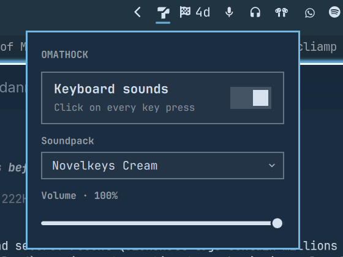

# OmaThock

Every key you press makes a mechanical keyboard sound. Ten switch recordings are
bundled — Holy Panda, Alpaca, Ink Black, Box Navy, buckling spring — and the bar
button gives you a toggle, the soundpack picker and a volume slider.

It is [thock](https://github.com/kamillobinski/thock) for Omarchy, and it plays
thock's soundpacks unchanged. The other keyboard-sound plugins on Linux read
`/dev/input`, which means adding yourself to the `input` group and running a
daemon or a compiled binary next to the shell. This one needs **no group, no
daemon and no binary**: Hyprland already sees every key and its Lua state is
scriptable over IPC, so the plugin asks the compositor to re-broadcast keycodes
and plays the WAVs inside the shell process you are already running.



## Install

```bash
omarchy plugin add https://github.com/TerrifiedBug/omathock.git --enable
```

That is the whole install. No restart, no group membership, nothing to compile,
no files outside `~/.config/omarchy`.

Requires Hyprland's Lua config (`~/.config/hypr/hyprland.lua`, the Omarchy 4
default). On a legacy `hyprland.conf` there is no key event to hook and the
panel says so.

## Using it

**Left-click** the keyboard icon in the bar for the panel. **Right-click** it to
mute and unmute — the icon dims when sounds are off.

| Control    | Does                                                      |
| ---------- | --------------------------------------------------------- |
| Toggle     | Turns the key hook on and off; off removes it from Hyprland |
| Soundpack  | Every pack found on disk, bundled and your own            |
| Volume     | 0–100; releasing the slider plays a sample click          |
| `Esc`      | Closes the panel                                          |

The panel is also a summonable surface:

```bash
omarchy-shell shell toggle io.github.terrifiedbug.omathock '{}'
```

## Settings

Bar widgets keep their settings inline on their bar entry in
`~/.config/omarchy/shell.json`, so `omarchy bar set` edits them:

```bash
omarchy bar set io.github.terrifiedbug.omathock volume 60
omarchy bar set io.github.terrifiedbug.omathock soundpack kailh-box-navy
```

| Setting     | Type    | Default            | What it does                                     |
| ----------- | ------- | ------------------ | ------------------------------------------------ |
| `enabled`   | boolean | `true`             | Register the key hook and play sounds            |
| `soundpack` | string  | `drop-holy-panda`  | Directory name of the pack to play               |
| `volume`    | integer | `100`              | Playback volume, 0–100                           |

All three apply immediately; the panel and the CLI write to the same place.

## Soundpacks

Bundled, all recorded by [tplai](https://github.com/tplai/kbsim) and packaged by
[thock-soundpacks](https://github.com/kamillobinski/thock-soundpacks):

`alps-skcm-blue` · `drop-holy-panda` · `durock-alpaca` · `gateron-ink-black` ·
`gateron-ink-red` · `gateron-turquoise-tealios` · `kailh-box-navy` ·
`novelkeys-cream` · `topre` · `IBM-buckling-spring`

Add your own from thock's collection, or any pack in the same format — a flat
folder with a `config.json` and its WAVs:

```bash
mkdir -p ~/.local/share/omathock/soundpacks/cherry-mx-brown
curl -L https://github.com/kamillobinski/thock-soundpacks/raw/refs/heads/main/keyboard/cherry_mx/mechvibes/brown_abs/186ca33e-9998-4a28-974c-c21ac353c16e.zip \
  | bsdtar -xf - -C ~/.local/share/omathock/soundpacks/cherry-mx-brown
```

Reopen the panel and it is in the list. The **directory name is the pack's
name** — `cherry-mx-brown` shows up as "Cherry Mx Brown" — and a user pack with
the same name as a bundled one replaces it. Packs must be WAV; `SoundEffect`
does not decode OGG. Mouse packs are not supported: Hyprland's Lua bus has no
mouse-button event.

## IPC

```bash
omarchy-shell omathock status                    # {"enabled":true,"soundpack":"drop-holy-panda",…}
omarchy-shell omathock toggle
omarchy-shell omathock soundpack kailh-box-navy  # "unknown" if no such pack
omarchy-shell omathock volume 30
omarchy-shell omathock refresh                   # rescan the soundpack directories
```

## How it works

One `hyprctl repl` call at startup registers a Lua subscription:

```lua
hl.on("input.keyboard.key", function(code, _, state)
  hl.dispatch(hl.dsp.event("omathock," .. code .. "," .. state))
end)
```

That callback runs on Hyprland's main thread with a 50 ms budget, so it does the
absolute minimum: it re-emits the keycode as a `custom>>omathock,<code>,<state>`
line on Hyprland's socket2. Quickshell is already listening to socket2, so the
key arrives inside the shell, gets translated from evdev code to a thock key
name, and plays one of the pack's takes for that key from a preloaded
`SoundEffect` — no file I/O, no process, no round trip on the keystroke path.
Packs with key-up recordings click on release too.

Runtime Lua state does not survive `hyprctl reload`, so the plugin re-registers
on `configreloaded`. Turning the toggle off, disabling the plugin, removing it
or hot-reloading it all remove the subscription from Hyprland.

## Privacy

While sounds are on, keycodes travel on Hyprland's socket2, which is readable by
processes running as you. This grants nobody a new capability — any program you
run could already install the same Lua hook, or read `/dev/input` if you are in
the `input` group — but it is worth knowing that the codes are on that bus. No
modifiers, no window titles and no text are broadcast, nothing is written to
disk, and turning the toggle off removes the hook entirely.

## Uninstall

```bash
omarchy plugin remove io.github.terrifiedbug.omathock
```

The hook is removed as the plugin unloads. `omarchy plugin disable` does the
same thing without deleting anything. If the shell is killed rather than
unloaded, the orphaned subscription keeps broadcasting keycodes harmlessly until
the next `hyprctl reload` or login.

## Hacking on it

Clone it, `omarchy plugin add "file://$PWD" --enable`, and edit the installed
copy in `~/.config/omarchy/plugins/io.github.terrifiedbug.omathock`. Saving a
file reloads the plugin; bar widgets already mounted need
`omarchy-restart-shell`. The key mapping and pack logic in `Model.js` are
Qt-free: `node --test test/`.

## License

MIT — see [LICENSE](LICENSE). The bundled soundpacks are MIT-licensed
recordings by Thomas Lai; see [NOTICE](NOTICE).
